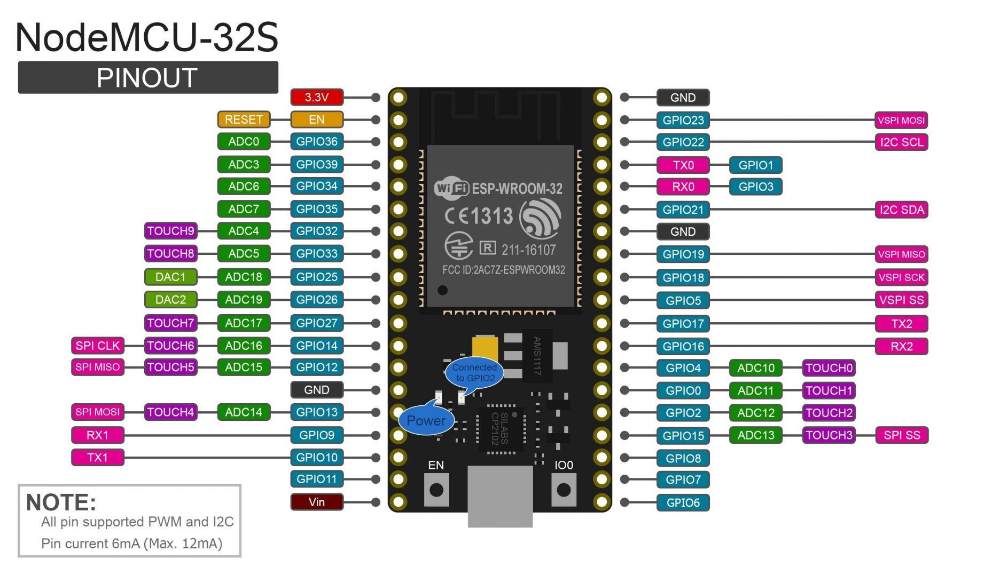

# sesitec2022-esp32

**Apresentação SESITEC 2022 - Introdução a automação Industrial utilizando tecnologias de embarcado e de programação web.**

Este repositório contém o programa usado para com a placa de desenvolvimento ESP32 com framework arduino para realizar a comunicação modbus com um dispositivo de interesse e servir estes dados via API json por conexão wifi.

**Sumário:**

- [sesitec2022-esp32](#sesitec2022-esp32)
- [Código](#código)
	- [Webserver](#webserver)
	- [Modbus](#modbus)

# Código

O código consiste na criação de duas tarefas do sistemas operacional FreeRTOS, uma para comunicação modbus e outra para a api e conexão wifi. O arquivo completo está em [main.ino](./main.ino).

```c++
void setup() {
  pinMode(RE, OUTPUT);
  pinMode(DE, OUTPUT);
  digitalWrite(RE, 0);
  digitalWrite(DE, 0);
  
  Serial.begin(115200);

  xTaskCreate(
    webserver_task,
    "webserver_task",
    4086,
    NULL,
    1,
    NULL
  );

  xTaskCreate(
    modbus_task,
    "modbus_task",
    4086,
    NULL,
    1,
    NULL
  );
}

void loop() {
  vTaskDelay(1);
}
```

A comunicação serial é iniciada e também são configurados os pinos a serem utilizados pelo CI de comunicação RS485.

Um delay é necessário em `void loop()` para que o watchdog do FreeRTOS não acione indevidamente.

## Webserver

Na parte da API criamos um objeto global do servidor, para porta `5050`, e a função de tarefa:

```c++
WebServer server(5050);
void webserver_task(void *data)
```

De forma simples, o código se resume em se conectar ao wifi, esperar pelo status `WL_CONNECTED`, escrever o IP obtido par ao console serial e quebrar o loop de espera.

Depois da conexão wifi, o webserver é iniciado, usando a função `server.on` é cadastrado uma rota http `/esp`, que depois sera acessada como `http://ip-do-esp32:5050/esp`. Seguido do `server.begin` que inicializa o servidor e então o loop infinito principal, que sempre chama a função `server.handleClient()` que recebe conexões de novos clientes sempre que houverem.

```c++
WiFi.begin(ssid, pass);

bool check = true;
bool waitWifi = true;
while(waitWifi){

	if(check){
		int st = WiFi.status();
		switch(st){
			case WL_CONNECTED:
				Serial.print("IP: ");
				Serial.println(WiFi.localIP());
				waitWifi = false;
				break;
		}  
	}

	delay(200);
}

server.on("/esp", HTTP_GET, esp_get);
server.begin();

while(1){
	server.handleClient();
	vTaskDelay(1);
}
```

Na rota `/esp`, temos a seguinte função de callback cadastrada:

```c++
void esp_get(){
  StaticJsonDocument<250> json;
  json["frequency"] = frequency;
  json["current"] = current;
  char jsonstr[250];
  serializeJson(json, jsonstr);
  
  server.send(200, "application/json", jsonstr);
}
```

Que cria um objeto json, armazena os valores de corrente e frequência em sua estrutura e depois é devolvido para o cliente em form de uma string json.

## Modbus

Para a comunicação modbus, a tarefa é da forma:

```c++
void modbus_task(void *data){
  ModbusMaster mod;
  Serial2.begin(19200, SERIAL_8N2);
  mod.begin(5, Serial2);
  mod.preTransmission(pre);
  mod.postTransmission(post);
  Serial.println("Starting modbus com");
  
  while(1){
    uint8_t res = mod.readHoldingRegisters(0x0003, 3);
  
    if(res == mod.ku8MBSuccess){
      frequency = mod.getResponseBuffer(0x02);
      current = mod.getResponseBuffer(0x00);
      Serial.print("read value");
    }

    Serial.print("MB code: ");
    Serial.println(mb_error_str(res));

    vTaskDelay(1000);
  }
}
```

Há a criação do objeto `ModbusMaster mod` e da serial `Serial2.begin(19200, SERIAL_8N2)`, esta serial é criada com velocidade de 19200 baud, 8 bits de dados, sem paridade e com 2 stop bits, esta deve ser a mesma configuração usado no escravo que terá seus dados lidos. `mod.begin(5, Serial2)` dita que o escravo tem id 5 na rede e usará para comunicação modbus a porta serial2, que no esp32 corresponde aos pinos 16 e 17. 



A ligação eletrônica é importante e será feita como na figura:


A ligação do LED e os 4 resistores de pullup no inicio podem ser ignorados.

Os pinos da serial serão ligados como: RX->RO e TX->DI.

Por fim a leitura será feita em código utilizando a função `uint8_t res = mod.readHoldingRegisters(0x0003, 3)`, onde o resultado da leitura será lido com a função `current = mod.getResponseBuffer(0x00)` somente se o resultado da comunicação for `res == mod.ku8MBSuccess`.

Também foi definido duas funções auxiliares repassadas como `mod.preTransmission(pre)` e `mod.postTransmission(post)`, que são executadas antes e depois da cada comunicação modbus, estas funções apenas habilitam e desabilitam os pinos de enable do MAX485, habilitando leitura e escrita.

```c++
void pre(){
  digitalWrite(RE, 1);
  digitalWrite(DE, 1);
}

void post(){
  digitalWrite(RE, 0);
  digitalWrite(DE, 0);
}
```